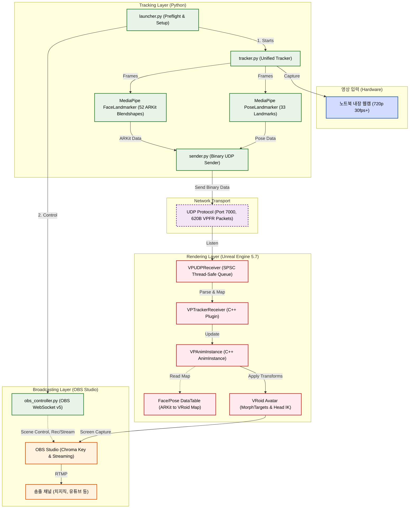

# 🎥 Virtual Production Pipeline (UE 5.7)

<p align="center">
  
</p>

본 프로젝트는 단일 웹캠과 비전 AI(MediaPipe)를 활용하여 언리얼 엔진 5.7 환경에서 구동되는 **실시간 버추얼 프로덕션 파이프라인**입니다. 파이썬 기반 런처 스크립트와 OBS Studio 연동을 통해 모션 캡처 추론부터 방송 라이브 송출 제어까지의 기능을 일원화했습니다. (단, 렌더링을 담당하는 언리얼 엔진과 OBS 프로그램 본체는 사전에 띄워두어야 합니다.)

## ✨ 주요 특징
- **Low-Latency Tracking**: 웹캠 기반 MediaPipe 듀얼 랜드마커(Face 52개 블렌드쉐이프, Pose 33개 관절) 동시 추론.
- **Custom UE C++ Plugin**: 블루프린트 노드 오버헤드 없이, 언리얼 엔진 C++로 직조된 전용 소켓 수신기(`VPTrackerReceiver`)를 통해 SPSC 큐(Thread-Safe) 기반 고성능 바이너리 파싱 지원.
- **Animation Retargeting**: C++ `VPAnimInstance` 및 커스텀 DataTable 매핑을 통한 ARKit -> 리깅 아바타 동적 호환 보장. (Yaw/Pitch/Roll 기반 Head IK 완비)
- **DevOps & Broadcasting**: OBS WebSocket을 제어하는 파이썬 스크립트(`obs_controller.py`)와 런처를 제공하여, AI 트래킹 모듈의 생명주기와 방송 플랫폼(스트리밍/녹화) 제어를 커맨드라인에서 일원화하여 손쉽게 관리.

## 🚀 아키텍처 다이어그램

아래 다이어그램은 프로젝트의 데이터 흐름(하드웨어 -> Python AI 추론 -> 네트워크 발신 -> 언리얼 리얼타임 렌더링 -> OBS 송출)을 나타냅니다.



## 💻 요구 사항 (Prerequisites)
- **Hardware**: 720p 30fps 이상 지원 웹캠, NVIDIA RTX 3060 이상(또는 동급 GPU 권장), RAM 16GB 이상
- **Software**: 
  - Python 3.12+ (및 `uv` 패키지 매니저)
  - Unreal Engine 5.7
  - OBS Studio v32.0 이상 (WebSocket 서버 활성화 필수)

## 🛠 설치 및 시작 가이드 (Getting Started)

### 1. 파이썬 환경 세팅
```bash
# 프로젝트 패키지 경로 진입
cd vp-tracker
# uv를 통한 빠르고 완벽한 의존성 설치
uv sync
```

### 2. OBS 세팅 및 환경 변수 구성
`.env` 파일을 `vp-tracker` 폴더 루트에 구성하여 OBS WebSocket 연결 비밀번호를 설정합니다.
```env
VP_OBS_PASSWORD=본인_OBS_웹소켓_비밀번호
```

### 3. 언리얼 플러그인 빌드
1. `VPPipeline.uproject` 파일 우클릭 후 **Generate Visual Studio project files** 클릭합니다.
2. 자동으로 생성된 `.sln` 파일을 통해 솔루션을 다시 빌드하거나, 엔진을 재실행하여 플러그인(`VPTrackerReceiver`)을 자동으로 컴파일합니다.

## 🎮 사용 방법 (Usage)
언리얼 엔진 에디터에 접속해 Play(PIE) 버튼을 누르고 OBS Studio를 켜둔 상태에서, 터미널 명령어를 통해 워크플로우를 시작합니다.

```bash
uv run launcher.py
```
런처가 실행된 이후 대화형 프롬프트에 아래의 명령어를 입력하여 방송을 제어할 수 있습니다.
- `stream` : OBS 스트리밍 송출 시작
- `rec` : 로컬 녹화 시작
- `status` : 트래킹 및 파이프라인 연결 상태 출력
- `stop` / `stoprec` : 스트리밍 / 녹화 파기 종료
- `quit` : 파이프라인 프로세스 및 런처 완전 종료

## 🔧 주요 트러블슈팅 및 기술적 극복 사례 (Troubleshooting)

- **ARKit 표정 명명 규칙과 커스텀 캐릭터 리깅 사이의 불일치 이슈 극복**
  - **문제**: MediaPipe의 추론 모델은 `eyeBlinkLeft` 등 애플의 표준 ARKit 네이밍을 도출하지만, 프로젝트에 이식된 VRoid 아바타는 `Fcl_EYE_Close_L` 방식의 비표준 Morph Target 네이밍을 사용하여 표정이 곧바로 엔진 내 캐릭터에 매핑되지 않았습니다.
  - **해결**: 단순히 코드를 하드코딩하는 방식 대신, 언리얼 `DataTable` 형태의 중간 매핑 아키텍처를 `VPAnimInstance`에 설계하였습니다. 이를 통해 런타임 성능 오버헤드 없이 유연한 이름 조합 매핑과 스케일 팩터 조정을 달성했습니다. (예: `jawOpen` 변수는 스케일 2.0 부스팅 및 미세 노이즈 필터링 데드존 0.15로 최적화)
  
---
*Powered by MediaPipe & Unreal Engine 5.7*
